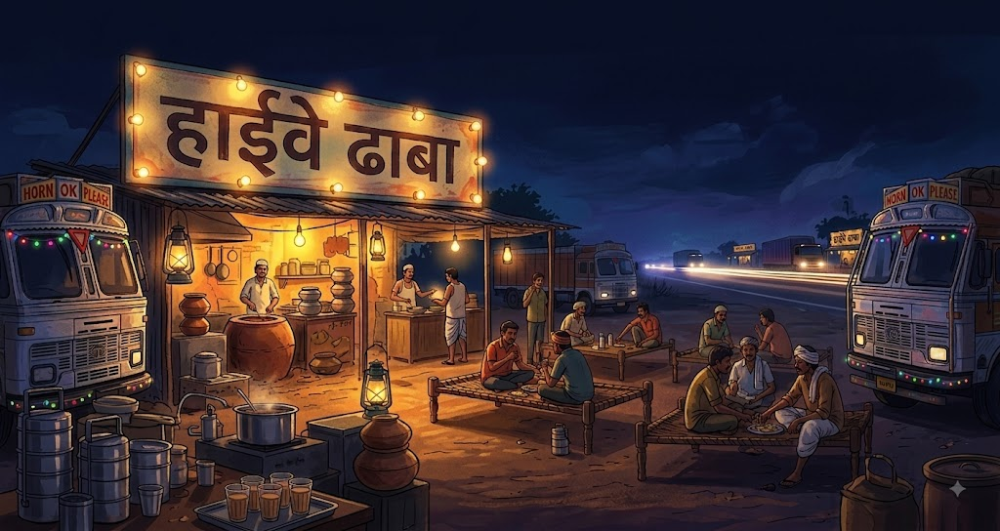

# 🚛 Highway Dhaba — 90s Jhankar Beats

**Highway Dhaba** is an immersive web-based music experience inspired by the nostalgic atmosphere of Indian highway dhabas, truck journeys, and late-night road trips.

Sit back, turn up the volume, and enjoy a collection of nostalgic Hindi songs while experiencing a virtual highway dhaba atmosphere. 🌙🎵

## 🌐 Live Demo

**Live Website:** https://celadon-scone-46db3d.netlify.app/

## ✨ Features

* 🎵 90s Hindi / nostalgic music experience
* 🚛 Indian highway & dhaba themed interface
* ▶️ Play / Pause music
* ⏮️ Previous and Next song controls
* ⏪ Rewind and ⏩ Forward controls
* 🔊 Volume control
* ⏱️ Interactive music progress bar
* 📋 Playlist with multiple songs
* 🎨 Immersive dark/night-time visual design
* ✨ Animated visual effects
* 📱 Responsive design for different screen sizes
* ⌨️ Keyboard controls for music playback
* 🎧 YouTube-based music playback

## 🛠️ Technologies Used

This project is built using simple web technologies:

* **HTML5** — Website structure
* **CSS3** — Styling, animations and responsive design
* **JavaScript** — Music player functionality and interactions
* **YouTube IFrame API** — Music playback
* **GitHub Pages / Netlify** — Deployment

No backend or database is required.

## 📁 Project Structure

```text
highway-dhaba/
│
├── index.html
├── background image/
│   └── highway-dhaba.jpg
│
├── music/
│   └── ...
│
└── README.md
```

## 🎵 Music Player

The website includes a custom music player with:

* Play / Pause
* Previous / Next
* Seek / Rewind / Forward
* Volume control
* Progress tracking
* Playlist
* Keyboard shortcuts

### Keyboard Shortcuts

| Key     | Action        |
| ------- | ------------- |
| `Space` | Play / Pause  |
| `←`     | Rewind        |
| `→`     | Forward       |
| `↑`     | Previous song |
| `↓`     | Next song     |

## 🚀 Run Locally

Clone the repository:

```bash
https://github.com/LalitKatre4/Highway-Dhaba-music-player.git
```

Open the project folder:

```bash
cd highway-dhaba
```

Because this is a static website, you can run it with any local web server.

For Python:

```bash
python -m http.server 8000
```

Then open:

```text
http://localhost:8000
```

## 🌍 Deployment

This project can be deployed easily using:

* GitHub Pages
* Netlify
* Vercel
* Any static web hosting service

Since the project uses only HTML, CSS and JavaScript, no server-side setup is required.

## 🎯 Purpose

Highway Dhaba is designed as more than a normal music player.

The goal is to create the feeling of sitting at an Indian highway dhaba at night, watching trucks pass by while listening to nostalgic Hindi music.

> **एक ढाबा, एक सफ़र और कुछ पुराने गाने। ❤️**

## 📸 Screenshots

Add screenshots of the website here:

```text


```

## 🔮 Future Improvements

Possible future features include:

* 🌧️ Rain mode
* 🌅 Sunset / sunrise modes
* 🚛 Animated moving highway
* 🔊 More realistic dhaba ambience
* 🎙️ Radio-style voice announcements
* 🎵 More music categories
* 🌙 Multiple environments such as Chai Tapri and Railway Journey
* 📱 Improved mobile experience
* 🎨 More interactive objects

## ⚠️ Disclaimer

This project is created as an experimental and educational web experience.

Music and third-party content are provided through their respective platforms and remain the property of their respective copyright holders. This project does not claim ownership of third-party music or media.

## 👨‍💻 Author

Lalit Katre
